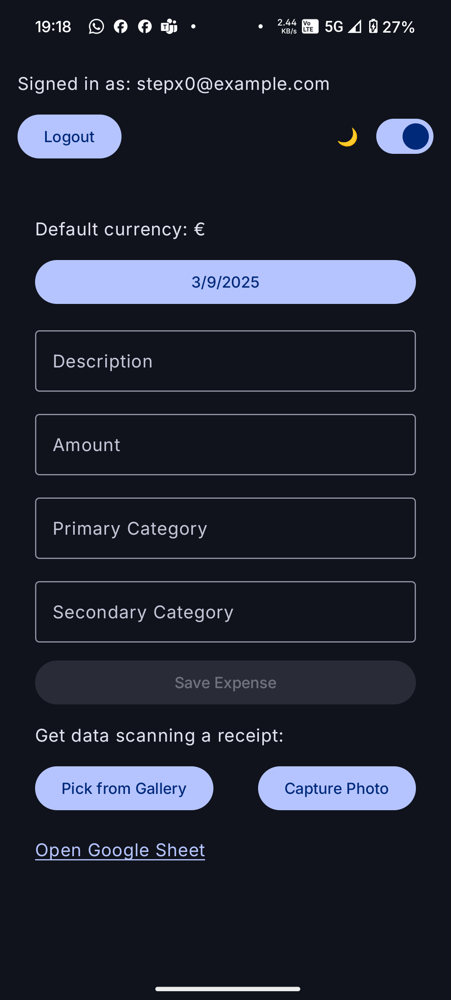
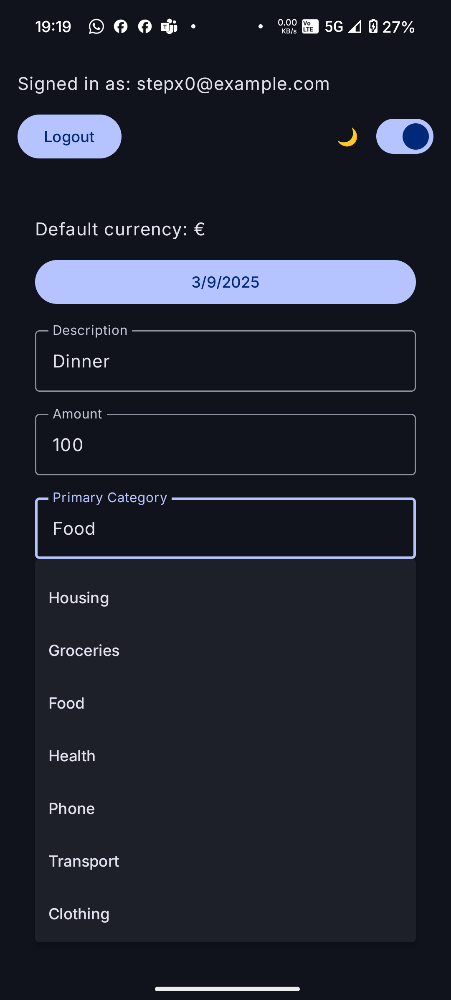
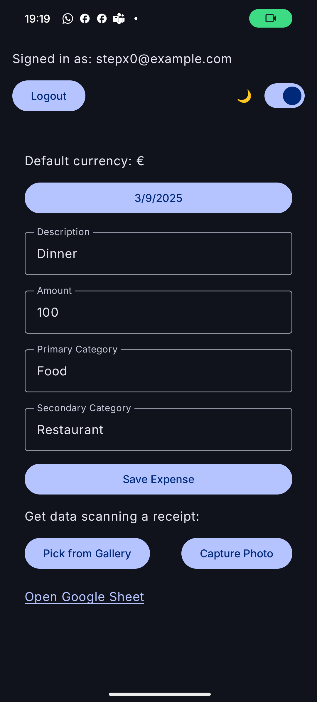

# Expenses Uploader

A simple Android app to log and upload personal expenses to Google Sheets.  
Built with Jetpack Compose, Google Sign-In, and Google Sheets API.
Second version enhanced with ML Kit OCR + TensorFlow Lite BERT for automatic receipt parsing.

---

## Features

- Google Sign-In authentication
- Add expenses through a minimal Compose UI
- Upload expenses to a Google Sheet
- Logout functionality
- Supports multiple devices (sign in with the same Google account)
- Receipt scanning:
    - Extracts text from receipts using ML Kit OCR
    - Processes raw OCR text with a TensorFlow Lite BERT model to identify
        - Description (store / item)
        - Amount (total expense)
- After scansion results, auto-fills expense fields in the form to save time
---

## Screenshots

Here are some screenshots to help visualize how it works:

<br>
<div>
  
  
  
</div>

// TODO: update screenshots with scanning logic enhancement.
---

## Setup

### 1. Clone the repository

```
git clone https://github.com/your-username/expenses-uploader.git
cd expenses-uploader
```

### 2. Configure your Google Cloud project to link Google sign-in and Google Sheets

- Go to Google Cloud Console
- Create a new project
- enable Google Sheets API:
    - Search APIS & Services
    - go to Library
    - search "Google Sheets API" and enable
    - do the same for "Google Drive API"
- Create an OAuth 2.0 Client ID for Android:
    - Package name (same of the app): com.stepx0.expenses_uploader
    - set the SHA-1: Use your project debug or release keystore (generate it locally form Gradle --> Tasks --> Android --> signingReport)
- Configure the OAuth consent screen (set it External, add https://www.googleapis.com/auth/spreadsheets scope)
- Ensure your email has access to the project: IAM --> Grant Access --> set email and role --> save

### 3. Set up local.properties

Create a `local.properties` file in your project root (it is `.gitignored`, so safe for private data) with following variable in it:

```
SPREADSHEET_ID=your_google_sheet_id_here
GID=your_google_sheet_specific_page_gid_here (optional)
PRIMARY_CAT_RANGE=range_of_expense_primary_category
SECONDARY_CAT_RANGE=range_of_expense_secondary_category
UPLOAD_RANGE=range_where_expense_is_uploaded
```

This ensures your personal spreadsheet stays private.

> [!NOTE]
> If Google Sheet file has multiple sheets in it, you can simply set sheet name before ranges (ex: Expenses!A:I)

> [!WARNING]
> Again, do not commit this file!

### 4. Build and Run

Open the project in Android Studio, then:

- Sync Gradle
- Build and run on an emulator or device
- Click Login with Google to authenticate
- Add expenses and upload to your Google Sheet

---

## Security Notes

Spreadsheet ID and OAuth credentials are never included in the public repo.

Use dummy/test data for public demos.

Real financial data should never be committed in the repo.

---

## License

This project is licensed under the MIT License. See the [LICENSE](https://en.wikipedia.org/wiki/MIT_License) info for details.
