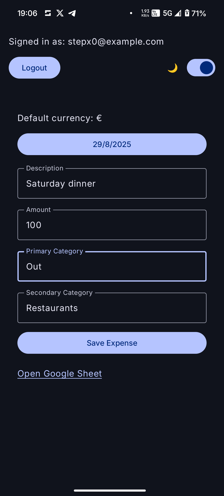

# Expenses Uploader

A simple Android app to log and upload personal expenses to Google Sheets.  
Built with Jetpack Compose, Google Sign-In, and Google Sheets API.

---

## Features

- Google Sign-In authentication
- Add expenses through a clean Compose UI
- Upload expenses to a Google Sheet
- Logout functionality
- Supports multiple devices (sign in with the same Google account)

---

## Screenshots

Here are some screenshots to help visualize how it works:

<br>
<div>
  
  
  
</div>

---

## Setup

### 1. Clone the repository

```
git clone https://github.com/your-username/expenses-uploader.git
cd expenses-uploader
```

### 2. Configure your Google Cloud project

- Go to Google Cloud Console
- Create a new project
- enable Google Sheets API (APIS & Services --> Library --> search "Google Sheets API" and enable, do the same for "Google Drive API")
- Create an OAuth 2.0 Client ID for Android:
    - Package name: com.stepx0.expenses_uploader
    - SHA-1: Use your debug or release keystore
- Configure the OAuth consent screen (set it External, add https://www.googleapis.com/auth/spreadsheets scope).

### 3. Set up local.properties

Create a `local.properties` file in your project root (it is `.gitignored`, so safe for private data) with following variable in it:

```
SPREADSHEET_ID=your_google_sheet_id_here
```

This ensures your personal spreadsheet stays private.

> [!WARNING]
> Again, do not commit this file!

### 4. Build and Run

Open the project in Android Studio, then:

- Sync Gradle
- Build and run on an emulator or device
- Click Login with Google to authenticate
- Add expenses and upload to your Google Sheet

---

## Security Notes

Spreadsheet ID and OAuth credentials are never included in the public repo.

Use dummy/test data for public demos.

Real financial data should never be committed.

---

## Dependencies

- Jetpack Compose
- Google Sign-In (com.google.android.gms:play-services-auth)
- Google Sheets API (com.google.api-client, com.google.apis:google-api-services-sheets)
- Accompanist Insets (com.google.accompanist:accompanist-insets)

---

## License

This project is licensed under the MIT License. See the [LICENSE](https://en.wikipedia.org/wiki/MIT_License) info for details.
